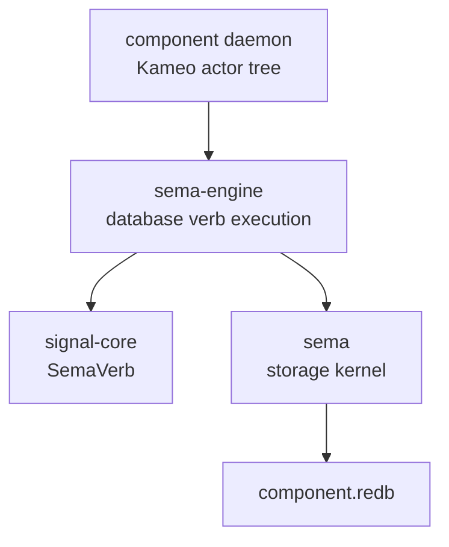

# sema-engine Architecture

`sema-engine` is the workspace's full typed database engine library. It
sits between the `sema` storage kernel and state-bearing component
daemons.

`sema` opens redb files, validates format/schema, and reads/writes typed
rkyv tables. `sema-engine` executes database-shaped Signal verbs over
registered record families. Component daemons own actors, sockets,
authorization, domain validation, and their own databases.

## Constraints

- `sema-engine` is a Rust library crate.
- `sema-engine` does not ship a daemon binary.
- `sema-engine` does not depend on Kameo.
- `sema-engine` does not depend on tokio.
- `sema-engine` does not depend on NOTA.
- `sema-engine` does not depend on `signal-persona-*` contract crates.
- `Engine` owns a `sema::Sema` handle.
- `Engine` opens storage through `Sema::open_with_schema`.
- `Engine` registers record families before executing database verbs.
- `Assert` writes records through a registered record family.
- `Match` reads records through a registered record family.
- Component domain validation happens before calling `Engine`.
- Component actors own ordering, supervision, sockets, and delivery.
- Snapshot identity and subscriptions land before real component
  migration.
- First real consumer migration is `persona-mind`.
- Criome migrates after `persona-mind`.

## Boundary



`sema-engine` deliberately knows nothing about Persona routing,
terminal delivery, auth sockets, or human text. Those are component
responsibilities.

## Current Surface

The first package implements the smallest useful pressure test:

```rust
let request = EngineOpen::new(database_path, SchemaVersion::new(1));
let mut engine = Engine::open(request)?;
let family = engine.register_table(TableDescriptor::new(TableName::new("thoughts")))?;
engine.assert(Assertion::new(family.clone(), thought))?;
let snapshot = engine.match_records(QueryPlan::all(family))?;
```

This is not the final query language. It proves the layering:
registered record family, Signal `Assert`, Signal `Match`, typed rkyv
values, and durable storage through `sema`.

## Package Order

1. Record trait and table registration.
2. Operation log and snapshot identity.
3. `QueryPlan` / `MutationPlan` execution.
4. `Subscribe` primitive with post-commit delivery.
5. `Validate` dry-run and table introspection.
6. `persona-mind` migration.
7. Criome migration.

## Non-Goals

- No schema-less storage open.
- No raw byte slot store.
- No direct component database access from this crate.
- No actors in this crate.
- No text parser in this crate.
- No daemon process in this crate.
