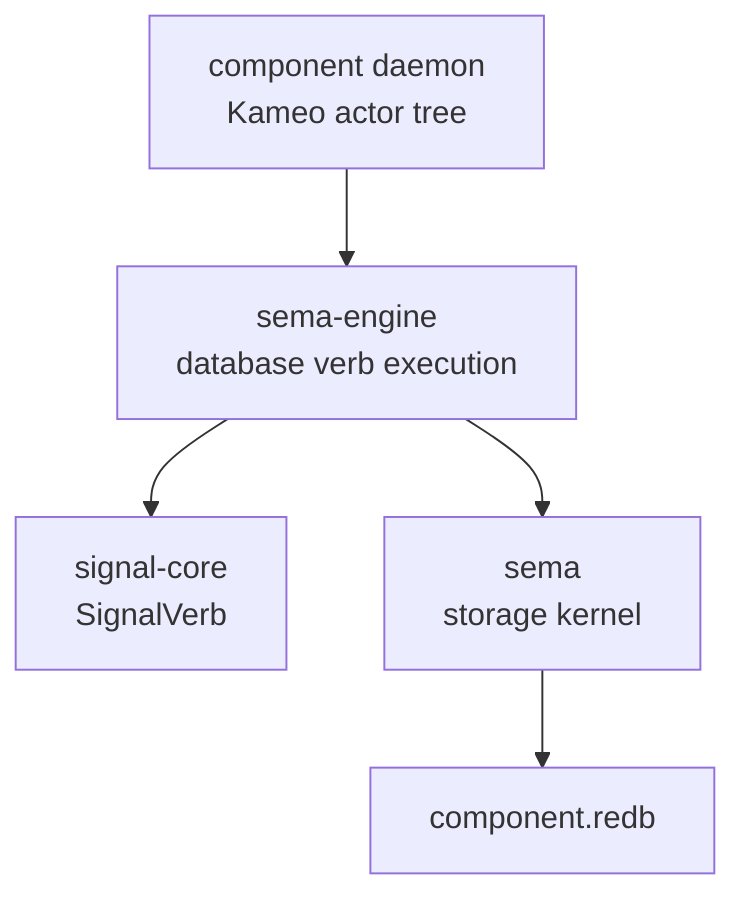

# sema-engine Architecture

`sema-engine` is the workspace's full typed database engine library. It
sits between the `sema` storage kernel and state-bearing component
daemons.

`sema` opens redb files, validates format/schema, and reads/writes typed
rkyv tables. `sema-engine` executes database-shaped Signal verbs over
registered record families. Component daemons own actors, sockets,
authorization, domain validation, and their own databases.

## Constraints

- `sema-engine` is a Rust library crate.
- `sema-engine` does not ship a daemon binary.
- `sema-engine` does not depend on Kameo.
- `sema-engine` does not depend on tokio.
- `sema-engine` does not depend on NOTA.
- `sema-engine` does not depend on `signal-persona-*` contract crates.
- `Engine` owns a `sema::Sema` handle.
- `Engine` opens storage through `Sema::open_with_schema`.
- `Engine` is a single-owner handle. Snapshot allocation and prevalidation
  read transactions sit outside the write transaction, so concurrent
  callers on the same `Engine` can race the commit log. Component daemons
  must own each `Engine` from one actor and serialise all engine calls
  through that actor.
- Consumers that still have unmigrated component-local tables use
  `Engine::storage_kernel()` rather than opening a second `sema::Sema`
  handle to the same redb file.
- `Engine` registers record families before executing database verbs.
- `Assert` writes records through a registered record family.
- `Assert` rejects records whose key already exists in the table with a
  typed `DuplicateAssertKey` error — `Mutate` is the only replacement
  path. The same check runs inside `Engine::commit` for any
  `WriteOperation::Assert` entry; failure rolls back the whole bundle.
- `Mutate` replaces existing records through a registered record family.
- `Retract` removes existing records through a registered record family.
- `Engine::commit` takes the engine-native `CommitRequest<RecordValue>`
  whose non-empty `Vec<WriteOperation<RecordValue>>` is the atomic unit
  for one registered table. Atomicity is **structural** — the commit's
  operation sequence is the boundary, not a separate verb. The
  `signal_core::Request<Payload>` carried on the wire is a different,
  payload-typed shape; each consumer daemon dispatches its
  domain-payload request into per-variant engine calls
  (`assert` / `mutate` / `retract` / `commit`).
- `Mutate` and `Retract` reject missing records with typed
  `RecordNotFound` errors.
- A multi-op commit rejects empty requests (impossible by `NonEmpty`
  type), duplicate write keys within one commit (`DuplicateWriteKey`),
  duplicate Assert keys against table state (`DuplicateAssertKey`), and
  missing mutation or retraction records (`RecordNotFound`) with typed
  errors before writing.
- `Match` reads records through a registered record family.
- `Validate` dry-runs executable read plans through a registered record
  family without mutating storage.
- `ReadPlan` owns query-algebra vocabulary for `Match`, `Subscribe`, and
  `Validate` payloads.
- `Constrain`, `Project`, `Aggregate`, `Infer`, and `Recurse` are sema-engine
  read-plan operators, not `signal-core` root verbs.
- The `SignalVerb` spine is closed at six roots: `Assert`, `Mutate`,
  `Retract`, `Match`, `Subscribe`, and `Validate`. `Atomic` is not a verb;
  multi-operation atomicity is structural.
- Schema/catalog operations are catalog data under the six roots, not a
  separate `Structure` root.
- Unsupported read-plan operators return typed `UnsupportedReadPlan` errors
  instead of pretending execution succeeded.
- `Assert`, `Mutate`, and `Retract` write one `CommitLogOperation` entry
  per operation in the same committed write transaction as the domain
  record.
- A multi-op commit writes one `CommitLogEntry` containing
  `NonEmpty<CommitLogOperation>` in the same committed write transaction
  as the domain records.
- `commit_log_range` returns bounded replay entries by `SnapshotId`.
- `CommitReceipt` carries the committed `SnapshotId` and operation count.
  Single-op and multi-op commits return the same receipt shape.
- `QuerySnapshot` carries the latest observed `SnapshotId`.
- `ValidationReceipt` carries the observed `SnapshotId` and record count.
- `Validate` does not write commit-log entries.
- `list_tables` exposes registered table descriptors without exposing
  the mutable catalog.
- `Subscribe` registers durable subscription metadata and returns an
  initial snapshot via the request's `Reply::Accepted` outcome.
- `Subscribe` emits deltas only after the mutation commit succeeds.
- For a multi-op commit, `Subscribe` emits one per-operation delta after
  the commit succeeds; every delta shares the commit `SnapshotId`.
- Sink delivery is downstream of the commit and cannot roll back the
  mutation.
- Subscription sinks choose detached or inline delivery. Detached is the
  default for blocking sinks; inline exists for actor enqueue sinks that need
  deterministic post-commit ordering without polling.
- Component domain validation happens before calling `Engine`.
- Component actors own ordering, supervision, sockets, and delivery.

## Boundary



`sema-engine` deliberately knows nothing about Persona routing,
terminal delivery, auth sockets, or human text. Those are component
responsibilities.

## Current Surface

A component daemon registers a record family, dispatches its typed
domain requests into per-variant engine calls, and reads through typed
plans:

```rust
let mut engine = Engine::open(EngineOpen::new(database_path, SchemaVersion::new(1)))?;
let family = engine.register_table(TableDescriptor::new(TableName::new("thoughts")))?;

// Single-op writes
engine.assert(Assertion::new(family.clone(), new_thought))?;
engine.mutate(Mutation::new(family.clone(), updated_thought))?;
engine.retract(Retraction::new(family.clone(), retired_key))?;

// Multi-op commit — atomic by request structure, not a separate verb.
// The engine takes an engine-native CommitRequest<RecordValue>, not a
// signal_core::Request<Payload>. Each consumer maps its typed request
// into per-variant engine calls.
engine.commit(
    CommitRequest::new(family.clone())
        .assert(new_thought)
        .mutate(updated_thought)
        .retract(retired_key),
)?;

let snapshot = engine.match_records(QueryPlan::all(family.clone()))?;
let validation = engine.validate(QueryPlan::all(family.clone()))?;
let _tables = engine.list_tables();
let _log = engine.commit_log_range(SequenceRange::from(snapshot.snapshot()))?;
let _subscription = engine.subscribe(QueryPlan::all(family.clone()), sink)?;
engine.storage_kernel().write(|transaction| {
    // temporary component-local tables that have not moved to engine verbs yet
    Ok(())
})?;
```

This proves the layering: registered record family, single-op `Assert` /
`Mutate` / `Retract`, structural multi-op `commit`, `Match`, `Validate`,
executable `ReadPlan` nodes for all/key/range reads, typed query-algebra
nodes for future constrain/project/aggregate/infer/recurse execution,
typed rkyv values, commit-log cursor, bounded log replay, table
introspection, best-effort post-commit subscription delivery for write
verbs, and durable storage through `sema`.

## Non-Goals

- No schema-less storage open.
- No raw byte slot store.
- No second redb handle for a component database already opened by
  `Engine`.
- No actors in this crate.
- No text parser in this crate.
- No daemon process in this crate.
