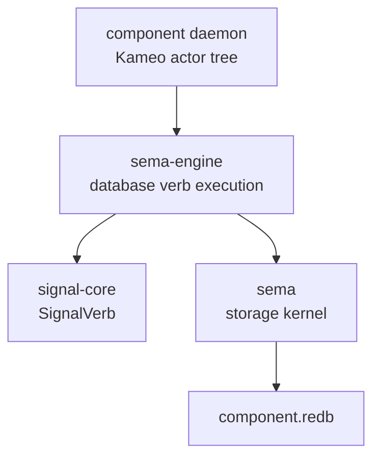

# sema-engine Architecture

`sema-engine` is the workspace's full typed database engine library. It
sits between the `sema` storage kernel and state-bearing component
daemons.

`sema` opens redb files, validates format/schema, and reads/writes typed
rkyv tables. `sema-engine` executes database-shaped Signal verbs over
registered record families. Component daemons own actors, sockets,
authorization, domain validation, and their own databases.

## Constraints

- `sema-engine` is a Rust library crate.
- `sema-engine` does not ship a daemon binary.
- `sema-engine` does not depend on Kameo.
- `sema-engine` does not depend on tokio.
- `sema-engine` does not depend on NOTA.
- `sema-engine` does not depend on `signal-persona-*` contract crates.
- `Engine` owns a `sema::Sema` handle.
- `Engine` opens storage through `Sema::open_with_schema`.
- Consumers that still have unmigrated component-local tables use
  `Engine::storage_kernel()` rather than opening a second `sema::Sema`
  handle to the same redb file.
- `Engine` registers record families before executing database verbs.
- `Assert` writes records through a registered record family.
- `Mutate` replaces existing records through a registered record family.
- `Retract` removes existing records through a registered record family.
- `Engine::commit` commits a multi-operation `Request<Payload>` whose
  `NonEmpty<Operation>` sequence is the atomic unit. Atomicity is
  **structural** — the request's operation sequence is the boundary, not
  a separate verb.
- `Mutate` and `Retract` reject missing records with typed errors.
- A multi-op commit rejects empty requests (impossible by `NonEmpty`
  type), duplicate write keys, and missing mutation or retraction
  records with typed errors before writing.
- `Match` reads records through a registered record family.
- `Validate` dry-runs executable read plans through a registered record
  family without mutating storage.
- `ReadPlan` owns query-algebra vocabulary for `Match`, `Subscribe`, and
  `Validate` payloads.
- `Constrain`, `Project`, `Aggregate`, `Infer`, and `Recurse` are sema-engine
  read-plan operators, not `signal-core` root verbs.
- The `SignalVerb` spine is closed at six roots: `Assert`, `Mutate`,
  `Retract`, `Match`, `Subscribe`, and `Validate`. `Atomic` is not a verb;
  multi-operation atomicity is structural.
- Schema/catalog operations are catalog data under the six roots, not a
  separate `Structure` root.
- Unsupported read-plan operators return typed `UnsupportedReadPlan` errors
  instead of pretending execution succeeded.
- `Assert`, `Mutate`, and `Retract` write one `CommitLogOperation` entry
  per operation in the same committed write transaction as the domain
  record.
- A multi-op commit writes one `CommitLogEntry` containing
  `NonEmpty<CommitLogOperation>` in the same committed write transaction
  as the domain records.
- `commit_log_range` returns bounded replay entries by `SnapshotId`.
- `CommitReceipt` carries the committed `SnapshotId` and operation count.
  Single-op and multi-op commits return the same receipt shape.
- `QuerySnapshot` carries the latest observed `SnapshotId`.
- `ValidationReceipt` carries the observed `SnapshotId` and record count.
- `Validate` does not write commit-log entries.
- `list_tables` exposes registered table descriptors without exposing
  the mutable catalog.
- `Subscribe` registers durable subscription metadata and returns an
  initial snapshot via the request's `Reply::Accepted` outcome.
- `Subscribe` emits deltas only after the mutation commit succeeds.
- For a multi-op commit, `Subscribe` emits one per-operation delta after
  the commit succeeds; every delta shares the commit `SnapshotId`.
- Sink delivery is downstream of the commit and cannot roll back the
  mutation.
- Subscription sinks choose detached or inline delivery. Detached is the
  default for blocking sinks; inline exists for actor enqueue sinks that need
  deterministic post-commit ordering without polling.
- Component domain validation happens before calling `Engine`.
- Component actors own ordering, supervision, sockets, and delivery.
- Subscribe lands before component-level live subscription delivery.
- First real consumer migration is `persona-mind`.
- Criome migrates after `persona-mind`.

## Boundary



`sema-engine` deliberately knows nothing about Persona routing,
terminal delivery, auth sockets, or human text. Those are component
responsibilities.

## Current Surface

The current package implements the first useful engine surface:

```rust
let request = EngineOpen::new(database_path, SchemaVersion::new(1));
let mut engine = Engine::open(request)?;
let family = engine.register_table(TableDescriptor::new(TableName::new("thoughts")))?;
engine.assert(Assertion::new(family.clone(), thought))?;
engine.mutate(Mutation::new(family.clone(), updated_thought))?;
engine.retract(Retraction::new(family.clone(), retired_key))?;
// Multi-op commit — atomic by request structure, not a separate verb.
let request = RequestBuilder::new()
    .with(MindRequest::SubmitThought(new_thought))
    .with(MindRequest::StatusChange(latest_thought))
    .with(MindRequest::RoleRelease(obsolete_key))
    .build()?;
engine.commit(request)?;
let snapshot = engine.match_records(QueryPlan::all(family))?;
let validation = engine.validate(QueryPlan::all(family))?;
let _tables = engine.list_tables();
let _log = engine.commit_log_range(SequenceRange::from(snapshot.snapshot()))?;
let _subscription = engine.subscribe(QueryPlan::all(family), sink)?;
engine.storage_kernel().write(|transaction| {
    // temporary component-local tables that have not moved to engine verbs yet
    Ok(())
})?;
```

This is not the final query language. It proves the layering:
registered record family, Signal `Assert`, `Mutate`, `Retract`,
structural multi-op commit, Signal `Match`, Signal `Validate`,
executable `ReadPlan` nodes for all/key/range reads, typed query-algebra
nodes for future constrain/project/aggregate/infer/recurse execution,
typed rkyv values, commit-log cursor, bounded log replay, table
introspection, best-effort post-commit subscription delivery for write
verbs, and durable storage through `sema`.

## Package Order

1. Record trait and table registration. Landed.
2. Commit log and snapshot identity. Landed for `Assert`, `Match`,
   and bounded replay.
3. `QueryPlan` / `ReadPlan` / `MutationPlan` execution. Started: all rows,
   exact key, and key range execute. Multi-op `Request<Payload>` is the
   first executable write-bundle plan. `Constrain`, `Project`, `Aggregate`,
   `Infer`, and `Recurse` exist as typed read-plan nodes and return typed
   unsupported errors until execution semantics land. Indexes and wider
   executable algebra are still future work.
4. `Subscribe` primitive with post-commit delivery. First slice landed:
   durable registration, initial snapshot, post-commit deltas with detached
   and inline sink modes, and replay cursor witnesses. Durable failure
   counters and consumer rebind helpers are still future work.
5. `Validate` dry-run and table introspection. Started:
   `list_tables()` and `Engine::validate` exist; index introspection is still
   future work.
6. `persona-mind` migration. First graph Assert/Match and Subscribe consumer
   slices have landed; further graph query/mutation widening still belongs to
   the consumer migration.
7. Criome migration.

## Rename Map (from the seven-root spine, pre-2026-05-15)

| Old name | New name |
|---|---|
| `SignalVerb::Atomic` | (no replacement — atomicity is structural) |
| `AtomicBatch` | `RequestBuilder<Payload>` in `signal-core`; `WriteBatch` or `CommitRequest` inside the engine |
| `AtomicOperation` | `Operation<Payload>` in `signal-core`; `WriteOperation` inside the engine |
| `AtomicReceipt` | `CommitReceipt` |
| `Engine::atomic` | `Engine::commit` |
| `Error::EmptyAtomicBatch` | type-level impossible via `NonEmpty<Operation>` (or `Error::EmptyCommit` if kept) |
| `Error::DuplicateAtomicKey` | `Error::DuplicateWriteKey` |
| `OperationLogEntry { verb: SignalVerb, ... }` | `CommitLogEntry { snapshot, operation_count, operations: NonEmpty<CommitLogOperation> }` |
| `operation_log_range` | `commit_log_range` |

## Non-Goals

- No schema-less storage open.
- No raw byte slot store.
- No second redb handle for a component database already opened by
  `Engine`.
- No actors in this crate.
- No text parser in this crate.
- No daemon process in this crate.
