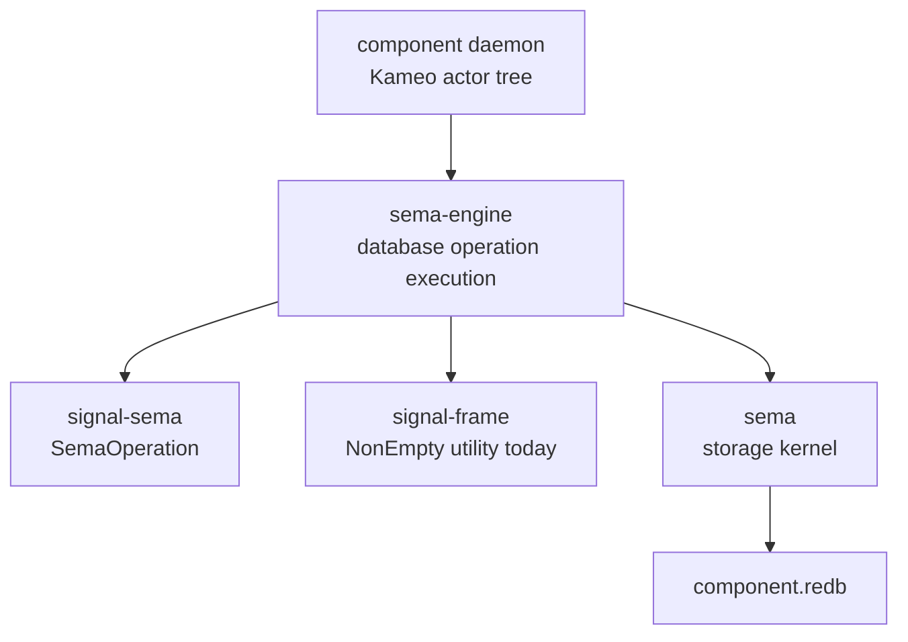

# sema-engine Architecture

`sema-engine` is the workspace's full typed database engine library. It
sits between the `sema` storage kernel and state-bearing component
daemons.

`sema` opens redb files, validates format/schema, and reads/writes typed
rkyv tables. `sema-engine` executes `signal-sema` database operations over
registered record families. Component daemons own actors, sockets,
authorization, domain validation, and their own databases.

## Constraints

- `sema-engine` is a Rust library crate.
- `sema-engine` does not ship a daemon binary.
- `sema-engine` does not depend on Kameo.
- `sema-engine` does not depend on tokio.
- `sema-engine` does not depend on NOTA.
- `sema-engine` does not depend on `signal-persona-*` contract crates.
- `Engine` owns a `sema::Sema` handle.
- `Engine` opens storage through `Sema::open_with_schema`.
- `Engine` is a single-owner handle. Snapshot allocation and prevalidation
  read transactions sit outside the write transaction, so concurrent
  callers on the same `Engine` can race the commit log. Component daemons
  must own each `Engine` from one actor and serialise all engine calls
  through that actor.
- Consumers that still have unmigrated component-local tables use
  `Engine::storage_kernel()` rather than opening a second `sema::Sema`
  handle to the same redb file.
- `Engine` registers record families before executing database operations.
- `Assert` writes records through a registered record family.
- `Assert` rejects records whose key already exists in the table with a
  typed `DuplicateAssertKey` error — `Mutate` is the only replacement
  path. The same check runs inside `Engine::commit` for any
  `WriteOperation::Assert` entry; failure rolls back the whole bundle.
- `Mutate` replaces existing records through a registered record family.
- `Retract` removes existing records through a registered record family.
- `Engine::commit` takes the engine-native `CommitRequest<RecordValue>`
  whose non-empty `Vec<WriteOperation<RecordValue>>` is the atomic unit
  for one registered table. Atomicity is **structural** — the commit's
  operation sequence is the boundary, not a separate operation. Public
  component contracts are different, payload-typed shapes; each consumer
  daemon dispatches its domain-payload request into per-variant engine calls
  (`assert` / `mutate` / `retract` / `commit`).
- `Mutate` and `Retract` reject missing records with typed
  `RecordNotFound` errors.
- A multi-operation commit rejects empty requests (impossible by `NonEmpty`
  type), duplicate write keys within one commit (`DuplicateWriteKey`),
  duplicate Assert keys against table state (`DuplicateAssertKey`), and
  missing mutation or retraction records (`RecordNotFound`) with typed
  errors before writing.
- `Match` reads records through a registered record family.
- `Validate` dry-runs executable read plans through a registered record
  family without mutating storage.
- `ReadPlan` owns query-algebra vocabulary for `Match`, `Subscribe`, and
  `Validate` engine operations.
- `Constrain`, `Project`, `Aggregate`, `Infer`, and `Recurse` are sema-engine
  read-plan operators, not public contract roots.
- The `signal_sema::SemaOperation` set is closed at six operations:
  `Assert`, `Mutate`, `Retract`, `Match`, `Subscribe`, and `Validate`.
  `Atomic` is not an operation; multi-operation atomicity is structural.
- Schema/catalog operations are catalog data under the six operations, not a
  separate `Structure` operation.
- Unsupported read-plan operators return typed `UnsupportedReadPlan` errors
  instead of pretending execution succeeded.
- `Assert`, `Mutate`, and `Retract` write one `CommitLogOperation` entry
  per operation in the same committed write transaction as the domain
  record.
- A multi-operation commit writes one `CommitLogEntry` containing
  `NonEmpty<CommitLogOperation>` in the same committed write transaction
  as the domain records.
- Every committed write transaction advances a durable `CommitSequence`.
  The sequence is a per-database high-water mark for version handover:
  a next-version daemon can copy state at sequence N, then replay commits
  from N+1 forward.
- Failed commits do not advance `CommitSequence`. The counter is durable
  per database and survives `Engine::close` / `Engine::open`.
- `Engine::current_commit_sequence` returns the current high-water mark
  so a peer reading the handover marker observes the same value the
  next successful commit will exceed.
- `replay_from_sequence` returns commit-log entries by `CommitSequence`.
- `commit_log_range` returns bounded replay entries by `SnapshotIdentifier`.
- `CommitReceipt` carries the committed `CommitSequence`, `SnapshotIdentifier`, and
  operation count. Single-operation and multi-operation commits return the
  same receipt shape.
- `QuerySnapshot` carries the latest observed `SnapshotIdentifier`.
- `ValidationReceipt` carries the observed `SnapshotIdentifier` and record count.
- `Validate` does not write commit-log entries.
- `list_tables` exposes registered table descriptors without exposing
  the mutable catalog.
- `Subscribe` registers durable subscription metadata and returns an
  initial snapshot via the request's `Reply::Accepted` outcome.
- `Subscribe` emits deltas only after the mutation commit succeeds.
- For a multi-operation commit, `Subscribe` emits one per-operation delta after
  the commit succeeds; every delta shares the commit `SnapshotIdentifier`.
- Sink delivery is downstream of the commit and cannot roll back the
  mutation.
- Subscription sinks choose detached or inline delivery. Detached is the
  default for blocking sinks; inline exists for actor enqueue sinks that need
  deterministic post-commit ordering without polling.
- Component domain validation happens before calling `Engine`.
- Component actors own ordering, supervision, sockets, and delivery.

## Boundary



`sema-engine` deliberately knows nothing about Persona routing,
terminal delivery, auth sockets, or human text. Those are component
responsibilities.

## Current Surface

A component daemon registers a record family, dispatches its typed
domain requests into per-variant engine calls, and reads through typed
plans:

```rust
let mut engine = Engine::open(EngineOpen::new(database_path, SchemaVersion::new(1)))?;
let family = engine.register_table(TableDescriptor::new(TableName::new("thoughts")))?;

// Single-operation writes
engine.assert(Assertion::new(family.clone(), new_thought))?;
engine.mutate(Mutation::new(family.clone(), updated_thought))?;
engine.retract(Retraction::new(family.clone(), retired_key))?;

// Multi-operation commit: atomic by commit structure, not a separate operation.
// Each consumer maps its typed public contract request into per-variant
// engine calls.
engine.commit(
    CommitRequest::new(family.clone())
        .assert(new_thought)
        .mutate(updated_thought)
        .retract(retired_key),
)?;

let snapshot = engine.match_records(QueryPlan::all(family.clone()))?;
let validation = engine.validate(QueryPlan::all(family.clone()))?;
let _tables = engine.list_tables();
let _log = engine.commit_log_range(SequenceRange::from(snapshot.snapshot()))?;
let _subscription = engine.subscribe(QueryPlan::all(family.clone()), sink)?;
engine.storage_kernel().write(|transaction| {
    // temporary component-local tables that have not moved to engine operations yet
    Ok(())
})?;
```

This proves the layering: registered record family, single-operation `Assert` /
`Mutate` / `Retract`, structural multi-operation `commit`, `Match`, `Validate`,
executable `ReadPlan` nodes for all/key/range reads, typed query-algebra
nodes for future constrain/project/aggregate/infer/recurse execution,
typed rkyv values, commit-log cursor, bounded log replay, table
introspection, best-effort post-commit subscription delivery for write
operations, and durable storage through `sema`.

## CommitSequence — durable high-water mark for handover

Every successful write transaction advances a per-database
`CommitSequence`. The counter is the workspace's mechanism for
zero-downtime component version handover: when a next-version daemon
starts beside a current-version daemon and needs to copy the current
database, it asks the current daemon for the high-water mark N, copies
state at N, then replays commits from N+1 forward. `MutationReceipt`,
`CommitReceipt`, and `CommitLogEntry` all carry `commit_sequence` so
peers can observe the same value the next successful commit will exceed.

`Engine::current_commit_sequence()` returns the high-water mark for use
in handover markers. `Engine::replay_from_sequence(start)` returns
commit-log entries by `CommitSequence` so a peer can drain deltas from
a known point. Failed commits do not advance the counter, so a crash
between transactions resumes cleanly at the previous high-water mark.

The sequence integrates with snapshots: `SnapshotIdentifier` still drives
subscription replay through the existing snapshot cursor;
`CommitSequence` is the boundary for cross-daemon handover. Both are
durable, monotonic, and per-database.

## Handover raw-payload storage discipline

`signal-version-handover`'s `Mirror` operation carries an unspecified
raw payload (raw bytes plus a `RecordKind` discriminant). When a
component daemon receives a mirrored write during the handover window
those raw bytes do **not** enter the sema-engine-managed typed tables
directly. The receiver persists them in a **separate raw-payload
container** outside the typed database — the engine's typed tables
only ever accept records produced by `version-projection`'s
reverse-projection step.

This keeps the typed database invariant intact: every record in
sema-engine's tables has gone through a typed shape known to the
receiver's signal-X library. Un-incorporated handover bytes live
beside the typed database, never inside it. Non-representable
payloads become typed `Divergence` operations on the handover wire,
again never silently landing as raw rows.

The container itself is the receiver daemon's responsibility — this
crate owns neither the container's on-disk shape nor its lifetime.
The discipline is the load-bearing rule: typed tables stay clean.
The typed-enum alternative for the `Mirror` payload is deferred per
`signal-version-handover/ARCHITECTURE.md` (Possible features), so the
raw-container discipline is the durable answer for the first
production handover.

## Non-Goals

- No schema-less storage open.
- No raw byte slot store. (Handover raw payloads live in a separate
  container outside this engine's typed tables — see the section
  above.)
- No second redb handle for a component database already opened by
  `Engine`.
- No actors in this crate.
- No text parser in this crate.
- No daemon process in this crate.
