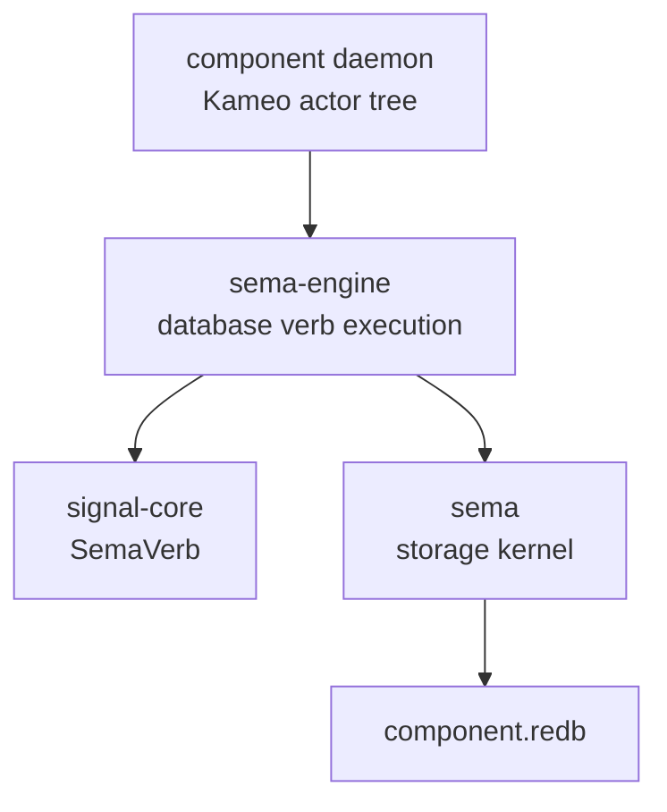

# sema-engine Architecture

`sema-engine` is the workspace's full typed database engine library. It
sits between the `sema` storage kernel and state-bearing component
daemons.

`sema` opens redb files, validates format/schema, and reads/writes typed
rkyv tables. `sema-engine` executes database-shaped Signal verbs over
registered record families. Component daemons own actors, sockets,
authorization, domain validation, and their own databases.

## Constraints

- `sema-engine` is a Rust library crate.
- `sema-engine` does not ship a daemon binary.
- `sema-engine` does not depend on Kameo.
- `sema-engine` does not depend on tokio.
- `sema-engine` does not depend on NOTA.
- `sema-engine` does not depend on `signal-persona-*` contract crates.
- `Engine` owns a `sema::Sema` handle.
- `Engine` opens storage through `Sema::open_with_schema`.
- Consumers that still have unmigrated component-local tables use
  `Engine::storage_kernel()` rather than opening a second `sema::Sema`
  handle to the same redb file.
- `Engine` registers record families before executing database verbs.
- `Assert` writes records through a registered record family.
- `Match` reads records through a registered record family.
- `Assert` writes one operation-log entry in the same committed write
  transaction as the domain record.
- `operation_log_range` returns bounded replay entries by `SnapshotId`.
- `MutationReceipt` carries the committed `SnapshotId`.
- `QuerySnapshot` carries the latest observed `SnapshotId`.
- `list_tables` exposes registered table descriptors without exposing
  the mutable catalog.
- `Subscribe` registers durable subscription metadata and returns an
  initial snapshot.
- `Subscribe` emits deltas only after the mutation commit succeeds.
- Sink delivery is downstream of the commit and cannot roll back the
  mutation.
- Subscription sinks choose detached or inline delivery. Detached is the
  default for blocking sinks; inline exists for actor enqueue sinks that need
  deterministic post-commit ordering without polling.
- Component domain validation happens before calling `Engine`.
- Component actors own ordering, supervision, sockets, and delivery.
- Subscribe lands before component-level live subscription delivery.
- First real consumer migration is `persona-mind`.
- Criome migrates after `persona-mind`.

## Boundary



`sema-engine` deliberately knows nothing about Persona routing,
terminal delivery, auth sockets, or human text. Those are component
responsibilities.

## Current Surface

The current package implements the first useful engine surface:

```rust
let request = EngineOpen::new(database_path, SchemaVersion::new(1));
let mut engine = Engine::open(request)?;
let family = engine.register_table(TableDescriptor::new(TableName::new("thoughts")))?;
engine.assert(Assertion::new(family.clone(), thought))?;
let snapshot = engine.match_records(QueryPlan::all(family))?;
let _tables = engine.list_tables();
let _log = engine.operation_log_range(SequenceRange::from(snapshot.snapshot()))?;
let _subscription = engine.subscribe(QueryPlan::all(family), sink)?;
engine.storage_kernel().write(|transaction| {
    // temporary component-local tables that have not moved to engine verbs yet
    Ok(())
})?;
```

This is not the final query language. It proves the layering:
registered record family, Signal `Assert`, Signal `Match`, typed rkyv
values, operation-log cursor, bounded log replay, table introspection,
best-effort post-commit subscription delivery, and durable storage
through `sema`.

## Package Order

1. Record trait and table registration. Landed.
2. Operation log and snapshot identity. Landed for `Assert`, `Match`,
   and bounded replay.
3. `QueryPlan` / `MutationPlan` execution. Started: `All` and `Key`
   match plans exist; mutation plans, range, index, aggregate, and
   constrain are still future work.
4. `Subscribe` primitive with post-commit delivery. First slice landed:
   durable registration, initial snapshot, post-commit deltas with detached
   and inline sink modes, and replay cursor witnesses. Durable failure
   counters and consumer rebind helpers are still future work.
5. `Validate` dry-run and table introspection. Started:
   `list_tables()` exists; validate and index introspection are still
   future work.
6. `persona-mind` migration. First graph Assert/Match and Subscribe consumer
   slices have landed; further graph query/mutation widening still belongs to
   the consumer migration.
7. Criome migration.

## Non-Goals

- No schema-less storage open.
- No raw byte slot store.
- No second redb handle for a component database already opened by
  `Engine`.
- No actors in this crate.
- No text parser in this crate.
- No daemon process in this crate.
